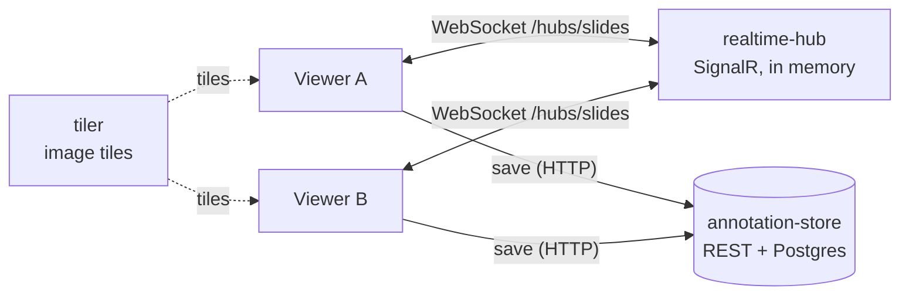
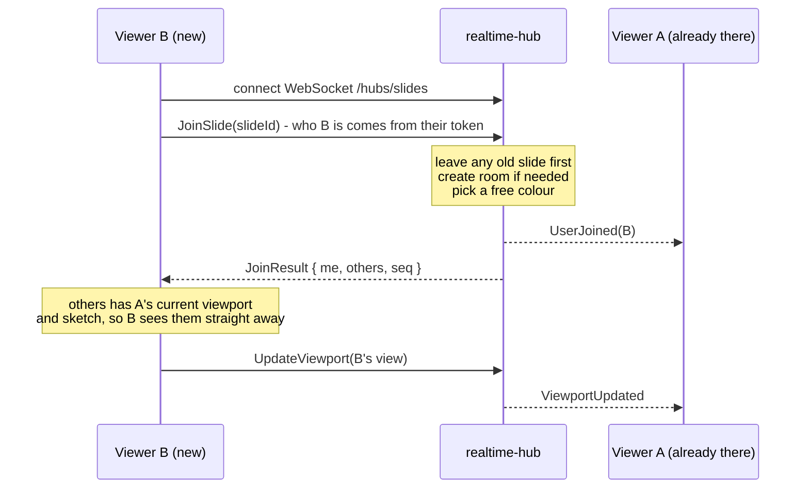
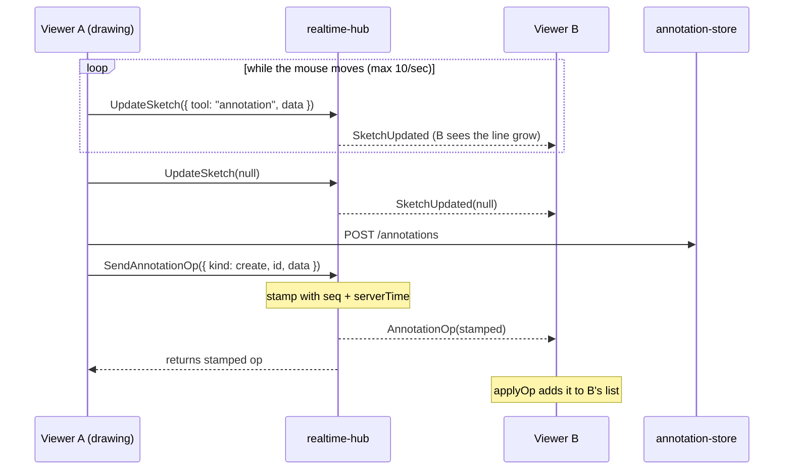
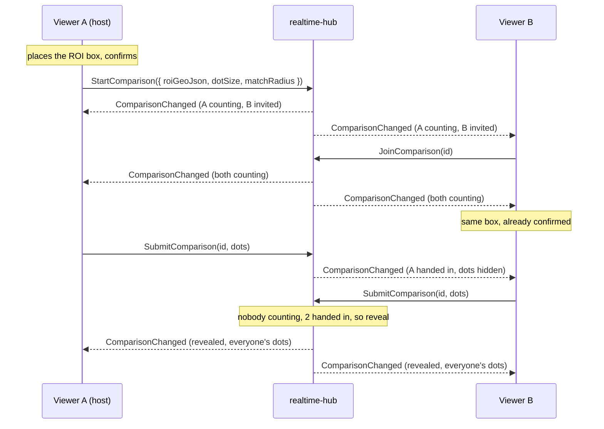
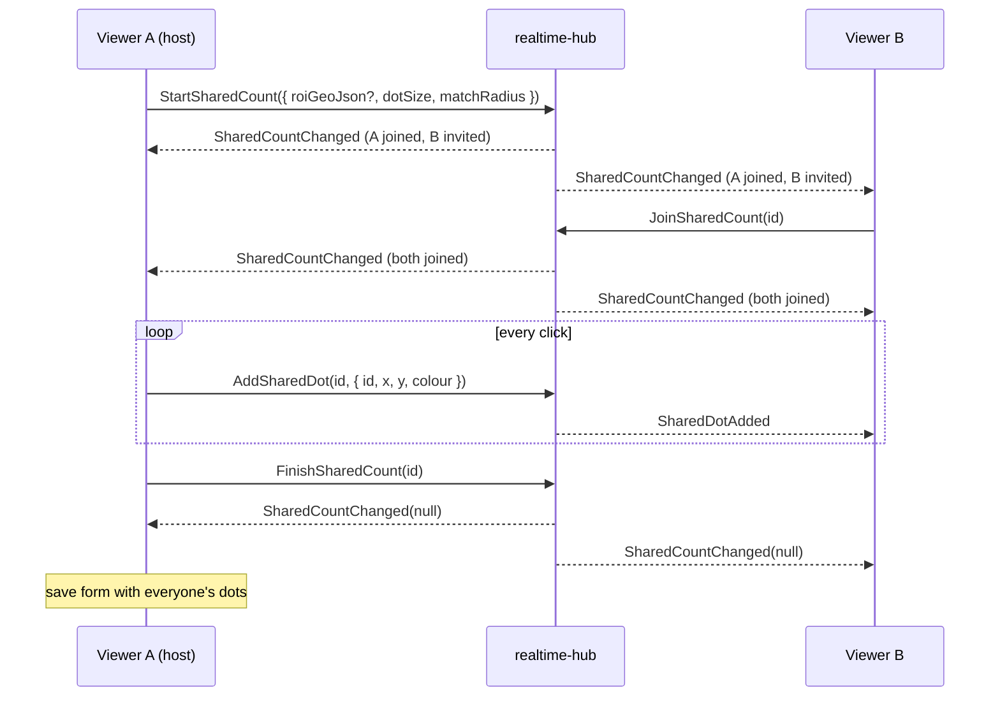

# realtime-hub breakdown

The realtime hub is a small .NET service that lets several people look at
and annotate the same slide at the same time. It doesn't store anything
permanently. Its job is to pass live changes between everyone viewing a
slide, and to remember just enough so someone who joins late can catch up.

.NET 10 · ASP.NET Core SignalR · Yjs (CRDT) · in memory · port 5180

The contract (every method, event and message shape) is in
[realtime-hub/README.md](../../realtime-hub/README.md). This page explains
how it all fits together.

## Contents

1. [Where it sits](#1-where-it-sits)
2. [Files](#2-files)
3. [One room per slide](#3-one-room-per-slide)
4. [Seven kinds of traffic](#4-seven-kinds-of-traffic)
5. [Joining a slide](#5-joining-a-slide)
6. [Drawing an annotation](#6-drawing-an-annotation)
7. [Two people typing in the same box](#7-two-people-typing-in-the-same-box)
8. [Comparison count](#8-comparison-count)
9. [Shared count](#9-shared-count)
10. [Viewer side](#10-viewer-side)
11. [Limits and validation](#11-limits-and-validation)
12. [Known gaps](#12-known-gaps)
13. [Glossary](#13-glossary)

## 1. Where it sits

The viewer (React + OpenLayers) talks to three services:

- **tiler** - serves image tiles. Stateless, cached, nothing to do with
  realtime.
- **annotation-store** - the REST API backed by Postgres. The source of
  truth: every annotation and cell count is saved here.
- **realtime-hub** - holds an open WebSocket to every viewer and relays live
  changes. If it goes down the viewer still works, you just stop seeing
  other people live.



Arrows show which way the data goes.

The hub never talks to annotation-store. Each viewer saves its own changes
over HTTP as normal, and also tells the hub so everyone else sees the change
straight away. That keeps the hub simple, and it doesn't break when
annotation-store's data model changes.

## 2. Files

| File                                                              | What it does                                                                                                                                                                                                                  |
| ----------------------------------------------------------------- | ----------------------------------------------------------------------------------------------------------------------------------------------------------------------------------------------------------------------------- |
| [Program.cs](../../realtime-hub/Program.cs)                       | Startup. Registers SignalR at `/hubs/slides`, raises the max message size to 1MB, allows any origin (CORS) for when it's called directly rather than through the viewer's proxy, wires up OpenTelemetry, and adds five read-only HTTP endpoints for debugging. |
| [Slides/SlideHub.cs](../../realtime-hub/Slides/SlideHub.cs), [SlideHub.SharedCount.cs](../../realtime-hub/Slides/SlideHub.SharedCount.cs) | The hub. Every method a browser can call lives here (`JoinSlide`, `UpdateViewport`, `OpenDoc` ...). Validates input, updates the room state, then broadcasts to the right group.                                               |
| [Slides/SlideRooms.cs](../../realtime-hub/Slides/SlideRooms.cs), [SharedCounts.cs](../../realtime-hub/Slides/SharedCounts.cs) | The in-memory state: which connections are in which slide, their viewports and sketches, the op counter, the shared text docs, the comparison count and the shared count. Everything goes through one lock, so it's thread safe.                                      |
| [Slides/Messages.cs](../../realtime-hub/Slides/Messages.cs)       | The wire format. A C# record for every message shape, plus a JSON setting so enums go over the wire as `"create"` rather than `0`.                                                                                            |
| [Tests/SlideHubTests.cs](../../realtime-hub/Tests/SlideHubTests.cs) | 29 integration tests. They boot the real app in memory and connect real SignalR clients to it.                                                                                                                              |

On the viewer side the matching code is
[RealtimeContext.tsx](../../image-viewer/src/context/RealtimeContext.tsx)
(the connection) and
[components/realtime/](../../image-viewer/src/components/realtime) (message
types, sketches and shared text fields).

## 3. One room per slide

Everyone looking at the same slide is in the same **room**. A room is made
when the first person joins and thrown away when the last person leaves.
Nothing survives a restart, which is fine because clients reconnect and
rejoin on their own.

Inside the hub a room is:

```
Room
 ├─ Participants   connectionId → Participant (name, colour, viewport, sketch)
 ├─ Docs           docId → SharedDoc (list of Yjs updates, list of editors)
 ├─ Seq            counter, goes up by 1 for every annotation op
 ├─ Comparison     the comparison count running on this slide, if any
 └─ SharedCount    the shared count running on this slide, if any
```

Rules that fall out of this:

- **A participant is a connection, not a user.** The same person in two
  tabs shows up twice. A connection can only be in one slide at a time -
  joining another slide moves it.
- **Each participant gets a colour** from a fixed palette of 10. The hub
  picks the first one nobody in the room has, and wraps round past 10
  people.
- **SignalR groups do the broadcasting.** Each slide is a group called
  `slide:{slideId}`, and each open text doc is its own smaller group
  `doc:{slideId}:{docId}`, so typing in one annotation's notes only goes to
  the people who have that annotation open.
- **Nothing is echoed back.** Every broadcast uses `OthersInGroup`, so the
  sender never gets its own message. The exceptions are
  `ComparisonChanged` and `SharedCountChanged` (see sections
  [8](#8-comparison-count) and [9](#9-shared-count)).

## 4. Seven kinds of traffic

Not all live data is the same. Some of it is throwaway (where your screen is
looking), some of it is an actual change to saved data. Each kind is handled
differently on purpose.

| Kind              | Example                                              | Hub method                               | Kept on hub?                     | Conflicts                                     |
| ----------------- | ---------------------------------------------------- | ---------------------------------------- | -------------------------------- | --------------------------------------------- |
| **Presence**      | "Guest 3f2a joined"                                  | `JoinSlide`, `LeaveSlide`                | Yes, while connected             | None needed                                   |
| **Viewport**      | The box on the map showing where someone is looking  | `UpdateViewport`                         | Latest only                      | Latest wins. Max 10 a second                  |
| **Sketch**        | A shape someone is part way through drawing          | `UpdateSketch`                           | Latest only, cleared on finish   | Latest wins. Never saved                      |
| **Annotation op** | Create, update or delete an annotation or cell count | `SendAnnotationOp`                       | No, just stamped with a number   | Last write wins, ordered by `seq`             |
| **Shared doc**    | Two people typing in the same label or notes box     | `OpenDoc`, `SendDocUpdate`, `CloseDoc`   | Yes, while anyone has it open    | Merged character by character with Yjs       |
| **Comparison**    | Everyone counting the same region, then comparing    | `StartComparison`, `JoinComparison`, `SubmitComparison`, `LeaveComparison` | Yes, until everyone's left it | Hub owns the state, one at a time per slide |
| **Shared count**  | Everyone adding to one count at once                 | `StartSharedCount`, `AddSharedDot`, `RemoveSharedDot`, `FinishSharedCount` ... | Yes, until it's finished | Each dot has one owner, so nothing to merge |

Why two conflict strategies? Two people dragging the same polygon at the
same moment is rare, so last write wins is enough for shapes and colours.
Free text is where people really do collide - if two people type into the
notes box, last write wins would silently throw one person's words away. So
text uses a CRDT (Yjs), which merges both. Comparing the two is planned for
the evaluation (see [libraries.md](../libraries.md)).

Events the hub sends to browsers:

| Event               | Sent when                                                             |
| ------------------- | --------------------------------------------------------------------- |
| `UserJoined`        | Someone joins your slide                                              |
| `UserLeft`          | Someone leaves, switches slide or drops                               |
| `ViewportUpdated`   | Someone else pans, zooms or rotates                                   |
| `SketchUpdated`     | Someone else draws, or finishes (`sketch: null`)                      |
| `AnnotationOp`      | Someone else creates, changes or deletes an annotation or cell count  |
| `DocUpdated`        | Another editor types in a text doc you have open                      |
| `DocEditorsChanged` | Someone opens or closes a doc you have open (the "also editing" list) |
| `ComparisonChanged` | Anything about the slide's comparison count changes                   |
| `SharedCountChanged` | Someone starts, joins or leaves the shared count, or it ends         |
| `SharedDotAdded` / `SharedDotRemoved` | Someone else adds or takes back a shared count dot  |

## 5. Joining a slide



1. The viewer opens a SignalR connection to `/hubs/slides`. SignalR uses
   WebSockets and falls back to other transports if it has to.
2. It calls `JoinSlide`. The connection already carries the user's
   Keycloak token (as `?access_token=`), and the hub takes their id and name
   from it rather than from anything the browser says.
3. The hub adds the connection to the room and the SignalR group, tells
   everyone else `UserJoined`, and returns a `JoinResult`: you, everyone
   already there (with their last viewport and sketch), and the room's
   current `seq`.
4. When the connection closes (tab closed, Wi-Fi drops), SignalR calls
   `OnDisconnectedAsync`. The hub removes the participant, closes any text
   docs they had open, and tells the room `UserLeft`.

## 6. Drawing an annotation



**Sketches** are the in-progress line. Before sending, the viewer simplifies
the geometry to half a screen pixel - a long freehand stroke can have
thousands of points nobody could tell apart. The hub keeps only the latest
sketch per person, so a late joiner sees a half-drawn shape too. Finishing
sends `null` straight away (skipping the throttle) so the sketch and the
saved shape are never on screen together.

**Ops** are the real change. The hub checks the op has an id (and data,
unless it's a delete), then stamps it:

```
StampedOp { seq: 42, serverTime, connectionId, userId, op: { kind, entity, id, data } }
```

`seq` goes up by one for every op in the room. It lets a client spot a gap
(a missed op) and put two edits to the same thing in order. `data` is passed
through without being read, so the hub doesn't care what an annotation looks
like inside. On the receiving side `applyOp` in
[realtime.ts](../../image-viewer/src/components/realtime/realtime.ts) adds,
merges or removes the item, and ignores a create for an id it already has.

The op send is fire and forget. If it gets lost nothing breaks - the change
is already saved in annotation-store, so the other person sees it next time
they load the slide.

## 7. Two people typing in the same box

An annotation's label and notes (and a cell count's label and notes) are
shared text fields. Each field is a `Y.Text` inside a Yjs doc. Every
keystroke makes a small binary _update_. Yjs guarantees that if everyone
ends up with the same set of updates, in any order, they all end up with the
same text. That's what makes it a CRDT.

The hub doesn't understand Yjs at all. It stores each doc as a plain list of
byte arrays and relays new ones. The doc id looks like
`annotation:{guid}`.

### Life of a shared doc

1. **Open.** Opening the edit form builds a local Yjs doc from the saved
   values and calls `OpenDoc(docId, seed)`, where the seed is that whole doc
   encoded as one update.
2. **Seeding.** If nobody has the doc open, the hub makes it with your seed
   as the first update and replies `seeded: true`. If someone already has it
   open, your seed is ignored and you get back every update so far to catch
   up from.
3. **Typing.** Each local change goes out via `SendDocUpdate`. The hub
   appends it to the list and relays it to the doc's group as `DocUpdated`.
   The receiver applies it with `Y.applyUpdate`.
4. **Closing.** When the last editor closes the form, leaves or drops, the
   doc is deleted from memory. The next person to open it seeds it fresh
   from the saved values.

### Edge cases handled

- **Join group before snapshot.** `OpenDoc` adds you to the SignalR group
  _before_ taking the snapshot of updates. An update landing in between
  reaches you twice, which Yjs ignores. The other way round could lose it.
- **Updates during open.** While the `OpenDoc` call is in flight, any
  `DocUpdated` that arrives is buffered and applied after the snapshot.
- **Seed text appearing twice.** Two separately seeded docs with the same
  starting text would merge into "Label Label". Each doc on the hub gets a
  fresh `instanceId` when it's made. On reconnect the viewer compares it with
  the one it had:
  - same id - same history, so merge both ways
  - different id - the hub's copy started from someone else's seed, so the
    viewer throws its local doc away, takes the hub's, and replays only the
    fields you typed in while offline on top
- **Caret jumping.** When someone else's edit lands while you're typing,
  `transformIndex` in
  [sharedFields.ts](../../image-viewer/src/components/realtime/sharedFields.ts)
  works out where your cursor should move to, and
  [useSharedFields.ts](../../image-viewer/src/components/realtime/useSharedFields.ts)
  puts it back after React re-renders the input.
- **Saving.** There's no Save button. The form autosaves to annotation-store
  500ms after typing stops. Remote changes trigger a save too, so whoever
  saves last always writes the fully merged text.

`GET /rooms/{slideId}/docs` shows each open doc's editor count, number of
updates and total bytes, for measuring doc growth during evaluation.

## 8. Comparison count

A comparison count is for checking how consistent people are. Everyone
counts the cells in the same box on their own, and once they've all handed
in, the dots are laid over each other so you can see where people agreed and
who missed what.



Unlike everything else, the hub actually owns this state rather than just
relaying it. Each counter is `invited`, `counting` or `submitted`, and the
hub decides what happens next:

- **Blind until the reveal.** Every `ComparisonChanged` goes out with
  everyone's dots stripped until it's revealed, so there's no way to copy -
  not even by watching the network traffic.
- **Reveal.** Once nobody is still counting and at least two have handed
  in. Anyone still sitting on an invite then misses out, so one person
  ignoring it doesn't hold everyone up.
- **Dropped** if it can never get to two (everyone declined or left), or
  once everyone has closed the results. Starting a new one also replaces a
  revealed one.
- **Late joiners** to the slide are invited to a running one. Leaving the
  slide or dropping counts as leaving the comparison.
- **Sent to everyone, sender included.** `ComparisonChanged` is the one
  broadcast that goes back to the caller too, so the viewer has a single
  place where its copy gets set rather than patching it from each reply.

The host picks the match radius (6µm, or 12 pixels on slides with no
microns-per-pixel) when starting, so everyone's results use the same one.

**Matching** happens in the viewer, in
[compare.ts](../../image-viewer/src/components/cell-count/comparison/compare.ts).
It goes one counter at a time: each of their dots joins the nearest cell
within the radius that they haven't already got a dot on (nearest pairs
first), and anything left over starts a new cell. That gives, per person,
their count, how many cells someone else found that they didn't (missed),
and how many only they found. Agreement is the share of cells everyone
found. It's greedy rather than a perfect matching, but it's deterministic,
so everyone sees the same numbers.

On the map, everyone's dots are shown in their presence colour, and each
cell not everyone found gets a dashed red ring. Afterwards each person can
save their own count as a normal cell count, or throw it away.

## 9. Shared count

The other way round from a comparison: several people add to one count at
the same time, usually each taking their own part of the slide, and
everyone sees every dot as it lands.



- **Dots are the only traffic that matters.** Each click sends one small
  `AddSharedDot`, and it goes to everyone but the sender, who has already
  drawn it. Joining, leaving and finishing send the whole count. A late
  joiner gets the whole thing too, in `JoinResult`.
- **No conflicts to merge.** Every dot belongs to whoever placed it, and you
  can only take back your own (that's what undo does). The dot id is made
  by the client, so redo puts back the same dot. That's why this doesn't
  need a CRDT.
- **The ROI is optional.** The host's own region of interest setting
  decides it. With one, everyone counts inside the host's box. Without,
  it's the whole slide.
- **Colours still mean what you pick.** Each dot keeps the colour its
  person chose, so colours can still be categories. Who placed it shows as
  a ring in their presence colour.
- **Double counts.** Where two people's dots are closer than the match
  radius, that's probably one cell counted from both sides of where they
  split the work, so both get a red ring and the panel says how many.
  `findDoubleCounts` in
  [sharedCount.ts](../../image-viewer/src/components/cell-count/shared/sharedCount.ts)
  buckets dots into a grid the size of the radius, so each dot only checks
  its neighbours.
- **Leaving keeps your dots.** You stay listed as `left` so they keep a
  name. If the host leaves, hosting passes to whoever joined first.
- **Finishing** is host only and ends it for everyone. The host's save form
  gets every dot, and it's saved as one normal cell count - everyone else
  sees it arrive in their Saved list like any other. Each dot is saved
  with `placedBy` (user id and name) so the saved count still shows who
  counted what. That's why contributors carry a `userId` - a connection id
  means nothing once everyone's gone. It lives inside the dots JSON, which
  annotation-store never reads, so it needed no migration.

## 10. Viewer side

[RealtimeContext.tsx](../../image-viewer/src/context/RealtimeContext.tsx)
owns the one SignalR connection and hands everything to the rest of the
viewer through React context.

- **Optional.** No hub URL configured means the viewer runs without
  realtime.
- **Reconnect.** SignalR's automatic reconnect handles short drops. A
  reconnect is a new connection id to the hub, so the viewer calls
  `JoinSlide` again and re-sends its last viewport and sketch. If automatic
  reconnect gives up, a retry loop takes over, starting at 2s and doubling up
  to 30s. Only the first failure shows a toast.
- **Rate limits.** Viewport and sketch sends are throttled to one per 100ms.
  The throttle always sends the last value in a burst, so others see you
  stop exactly where you stopped.
- **Colour changes** on an annotation go out every 200ms while you drag the
  picker, so others see it change live.

## 11. Limits and validation

| Limit                   | Value                                                          | Why                                                                         |
| ----------------------- | -------------------------------------------------------------- | --------------------------------------------------------------------------- |
| Max SignalR message     | 1MB                                                            | The 32KB default silently dropped long freehand annotations                 |
| Max doc update or seed  | 64KB                                                           | Label and notes are short. Stops one client filling the hub's memory       |
| Max doc id length       | 128 chars                                                      | Same reason                                                                 |
| Required fields         | slideId, op id, op data (not delete), sketch tool/data         | A bad call throws a `HubException` back to the caller only, never to others |
| Must join first         | Every method except `JoinSlide`                                | "Join a slide first"                                                        |
| Must open doc first     | `SendDocUpdate`                                                | "Open the doc first"                                                        |
| Comparison ROI          | 16K chars                                                      | Only ever a box                                                             |
| Comparison dots         | 10,000, finite x and y                                         | Far more than anyone clicks by hand                                         |
| Shared count dots       | 10,000, finite x and y, a colour and a unique id               | Same reason                                                                 |
| Comparison state        | Join from invited, submit from counting, one running per slide | The reason comes back as a `HubException`                                   |
| Shared count state      | Add/remove once joined, remove only your own, finish host only | Same                                                                        |

**Debug endpoints:** `GET /rooms` (slide → number of people),
`GET /rooms/{slideId}` (who's in it), `GET /rooms/{slideId}/docs` (open text
docs), `GET /rooms/{slideId}/comparison` (the running comparison, blind like
over the hub), `GET /rooms/{slideId}/sharedcount` (the running shared count). In Development there's also Scalar at `/scalar`.

**Telemetry:** traces, metrics and logs go to the same Grafana dashboard as
the other services, including each hub method call and the number of open
connections. If Grafana isn't running nothing breaks.

## 12. Known gaps

- **No guest links yet.** Everyone signs in with Keycloak. Invite links
  for people without an account, and host / editor / viewer roles for a
  session, are next (see [thought-process.md](../thought-process.md)).
- **One copy only.** State is in memory, so two copies of the hub would
  split users between them. Scaling out needs a Redis backplane or Azure
  SignalR Service.
- **CORS allows any origin.** Left over from LAN testing - the viewer now
  goes through its dev server's proxy, so it isn't needed there. Needs a real
  origin list before deploying.
- **Ops are relay only.** The hub doesn't replay missed ops - a client that
  misses one catches up on the next load. `seq` also resets when a room
  empties.
- **No doc compaction.** A doc's update list grows until the last editor
  leaves. Fine for short fields that live for one editing session.
- **Double counts aren't saved.** Each dot does keep who placed it (see
  [section 9](#9-shared-count)), but the double-count flags are only worked
  out live.
- **Shared counts aren't split up.** Nothing stops two people counting the
  same patch. The double-count rings catch it after the fact, and people's
  viewport boxes show who's where, but the hub doesn't hand out areas.
- **Comparisons aren't saved.** The results only live on the hub until
  everyone closes them. Each person can save their own count, but not the
  comparison itself.

## 13. Glossary

| Term              | Meaning                                                                                                              |
| ----------------- | -------------------------------------------------------------------------------------------------------------------- |
| SignalR           | Microsoft's real-time messaging library for ASP.NET. Handles WebSockets, reconnects and groups, and has a JS client |
| Hub               | A SignalR class whose public methods browsers can call, and which can call methods back on browsers                  |
| Group             | A named set of connections. Sending to a group sends to everyone in it                                               |
| Connection id     | A unique id SignalR gives each live connection. New on every reconnect                                               |
| Viewport          | What part of the slide someone can see: centre, zoom (resolution), rotation and bounding box                        |
| Op                | Short for operation. One create, update or delete of an annotation or cell count                                     |
| Last write wins   | When two changes clash, the later one replaces the earlier one                                                       |
| CRDT              | Conflict-free replicated data type. Edits from different people merge in any order and everyone ends up the same     |
| Yjs               | A JavaScript CRDT library, used here for shared text fields                                                          |
| Comparison count  | Several people count the same ROI on their own, then their dots are matched up to see where they agree               |
| Match radius      | How close two people's dots have to be to count as the same cell                                                     |
| Shared count      | Several people add to one count at once, each seeing everyone's dots live                                            |
| Double count      | Two people's dots on what looks like the same cell in a shared count                                                 |
